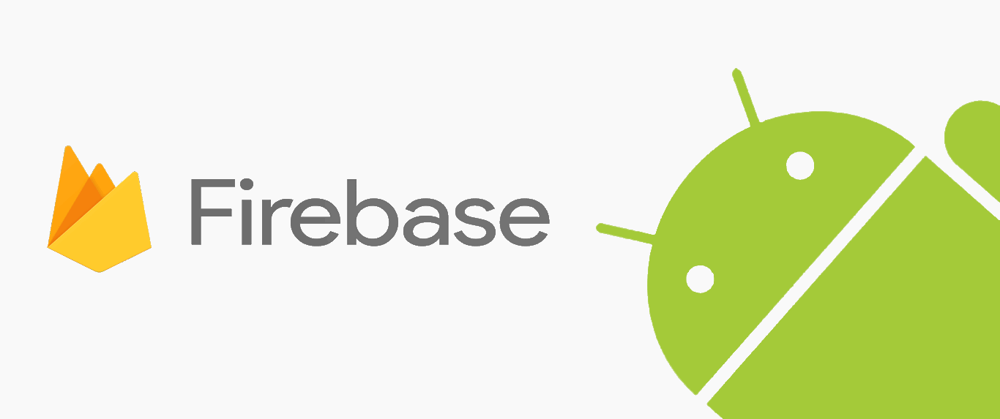
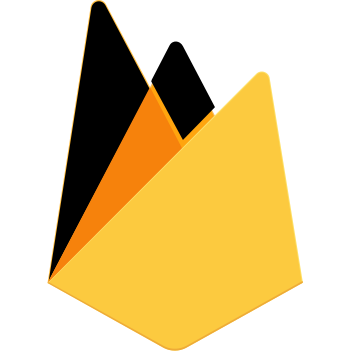

<!--
*** Thanks for checking out the Best-README-Template. If you have a suggestion
*** that would make this better, please fork the repo and create a pull request
*** or simply open an issue with the tag "enhancement".
*** Thanks again! Now go create something AMAZING! :D
-->

<!-- PROJECT SHIELDS -->
<!--
*** I'm using markdown "reference style" links for readability.
*** Reference links are enclosed in brackets [ ] instead of parentheses ( ).
*** See the bottom of this document for the declaration of the reference variables
*** for contributors-url, forks-url, etc. This is an optional, concise syntax you may use.
*** https://www.markdownguide.org/basic-syntax/#reference-style-links
-->
[![Contributors][contributors-shield]][contributors-url]
[![Forks][forks-shield]][forks-url]
[![Stargazers][stars-shield]][stars-url]
[![Issues][issues-shield]][issues-url]
[![MIT License][license-shield]][license-url]
[![LinkedIn][linkedin-shield]][linkedin-url]

<!-- PROJECT LOGO -->
 

  

  <h3 align="center">Canteen Automation System</h3>
  <h4 align="center">(CAS)</h4>

  

     
    <a href="https://github.com/Vk-Demon/CAS-App"><strong>Explore the docs »</strong></a>
     
     
    <a href="https://github.com/Vk-Demon/CAS-App">View Demo</a>
    ·
    <a href="https://github.com/Vk-Demon/CAS-App/issues">Report Bug</a>
    ·
    <a href="https://github.com/Vk-Demon/CAS-App/issues">Request Feature</a>
  

<!-- TABLE OF CONTENTS -->

  
Table of Contents

  <ol>
    <li><a href="#about-the-project">About The Project</a>
    <li><a href="#built-with">Built With</a></li>
	<li><a href="#license">License</a></li>
	<li><a href="#screenshots">Screenshots</a></li>
    <li><a href="#contact">Contact</a></li>
  </ol>

<!-- ABOUT THE PROJECT -->
## About The Project

CAS is an android application that it greatly simplifies the ordering process for both the customer and the canteen.

## Built With
  

    
  

   
  
 
  <a href="https://developer.android.com/docs" target="_blank" >Android Studio</a>
  

   
  
 
  <a href="https://firebase.google.com/docs?gclid=CjwKCAjwpKCDBhBPEiwAFgBzj1GSDzRaMmrPaXRfTQT5kWcnS49ms3qWTfmoQZwRPGQHckGEM99WvhoCgdcQAvD_BwE&gclsrc=aw.ds" target="_blank" >Firebase</a>
  

  
  
  
<!-- LICENSE -->
## License

Distributed under the MIT License. See `LICENSE` for more information.

<!-- SCREENSHOTS -->
## Screenshots

  
 
   
  

  
 
   
  

  
 
   
  

<!-- CONTACT -->
## Contact

Developer - Vimal Kannan (vk2049627@gmail.com)

Project Link: [https://github.com/Vk-Demon/CAS-App](https://github.com/Vk-Demon/CAS-App)

<!-- MARKDOWN LINKS & IMAGES -->
<!-- https://www.markdownguide.org/basic-syntax/#reference-style-links -->
[contributors-shield]: https://img.shields.io/github/contributors/Vk-Demon/CAS-App.svg?style=for-the-badge
[contributors-url]: https://github.com/Vk-Demon/CAS-App/graphs/contributors
[forks-shield]: https://img.shields.io/github/forks/Vk-Demon/CAS-App.svg?style=for-the-badge
[forks-url]: https://github.com/Vk-Demon/CAS-App/network/members
[stars-shield]: https://img.shields.io/github/stars/Vk-Demon/CAS-App.svg?style=for-the-badge
[stars-url]: https://github.com/Vk-Demon/CAS-App/stargazers
[issues-shield]: https://img.shields.io/github/issues/Vk-Demon/CAS-App.svg?style=for-the-badge
[issues-url]: https://github.com/Vk-Demon/CAS-App/issues
[license-shield]: https://img.shields.io/github/license/CUE-ASAP/Main-Web.svg?style=for-the-badge
[license-url]: https://github.com/Vk-Demon/CAS-App/blob/main/LICENSE
[linkedin-shield]: https://img.shields.io/badge/-LinkedIn-black.svg?style=for-the-badge&logo=linkedin&colorB=555
[linkedin-url]: https://linkedin.com/in/Vk-Demon
